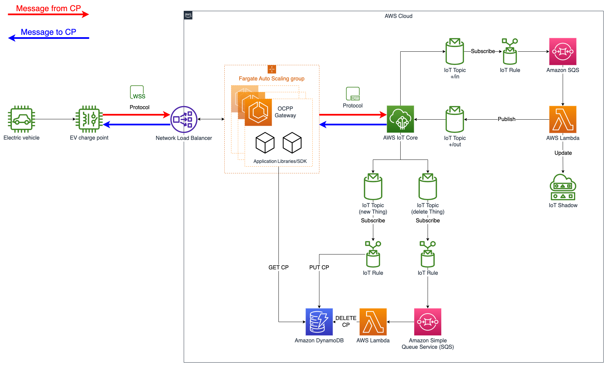
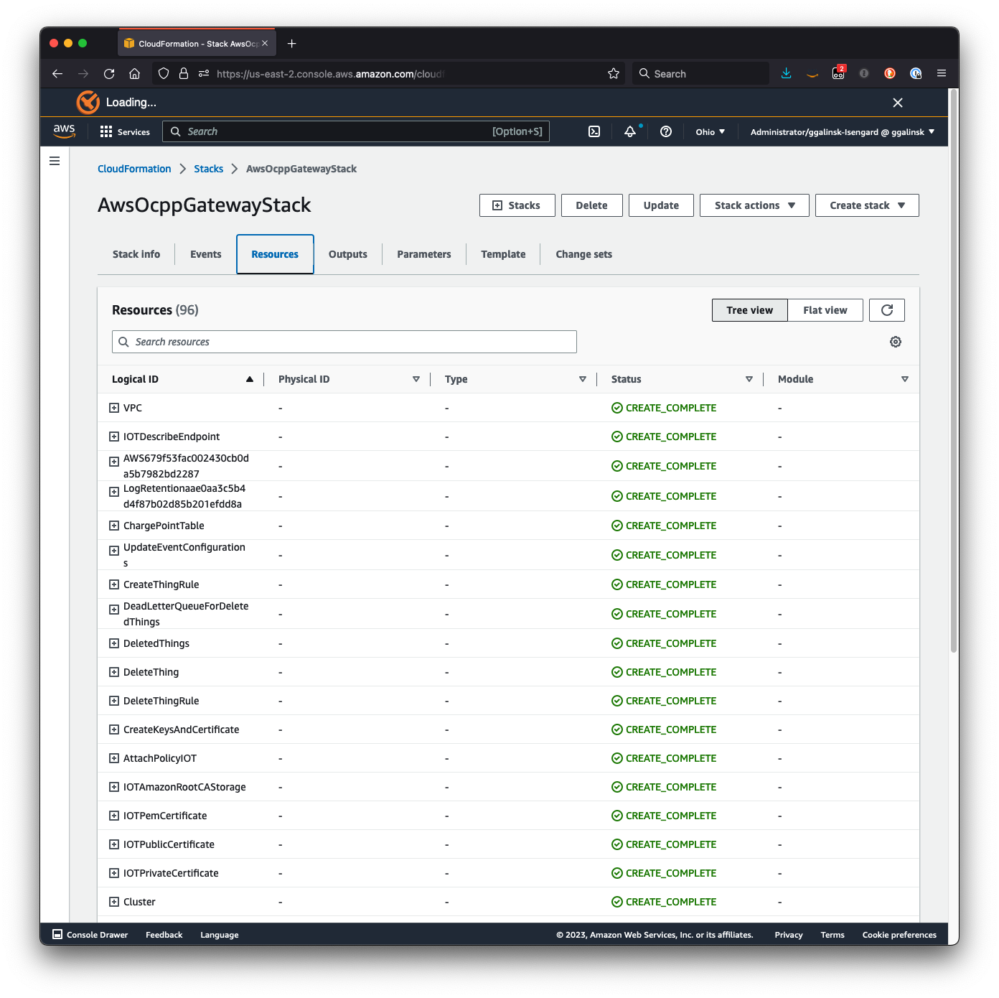
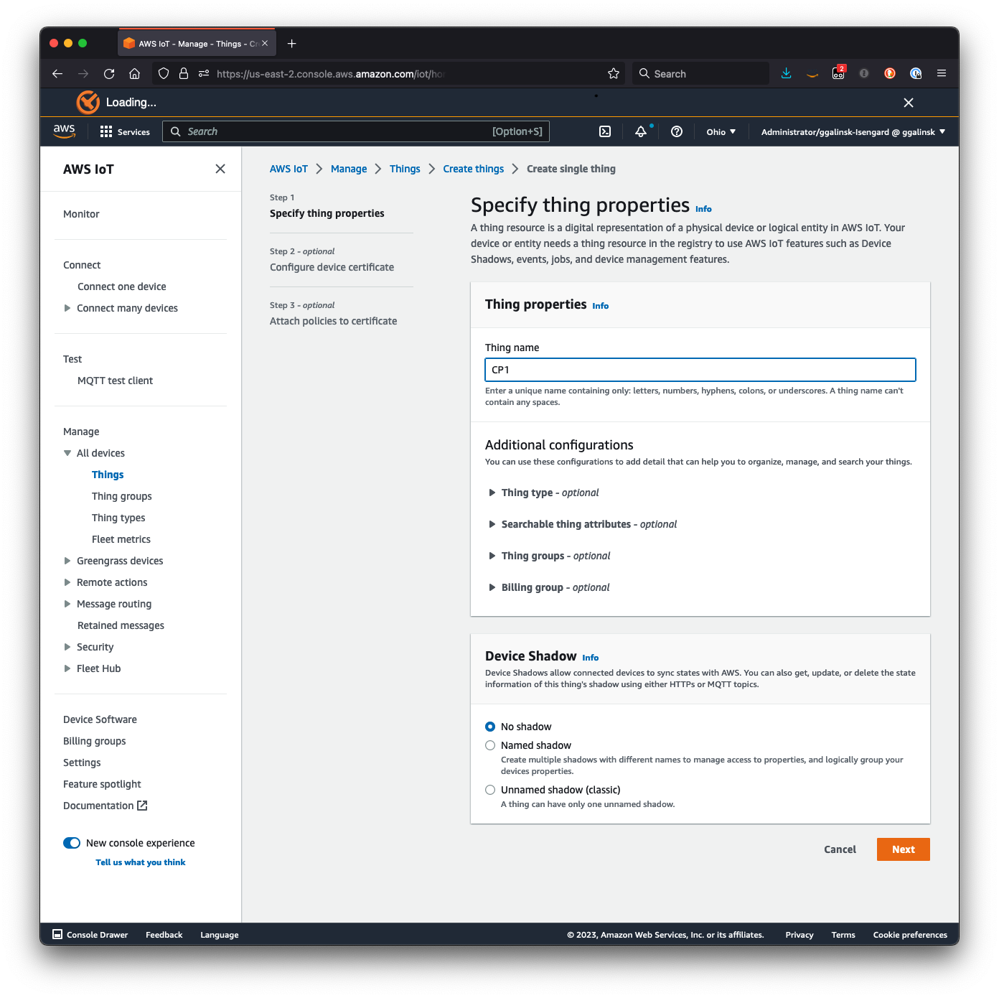
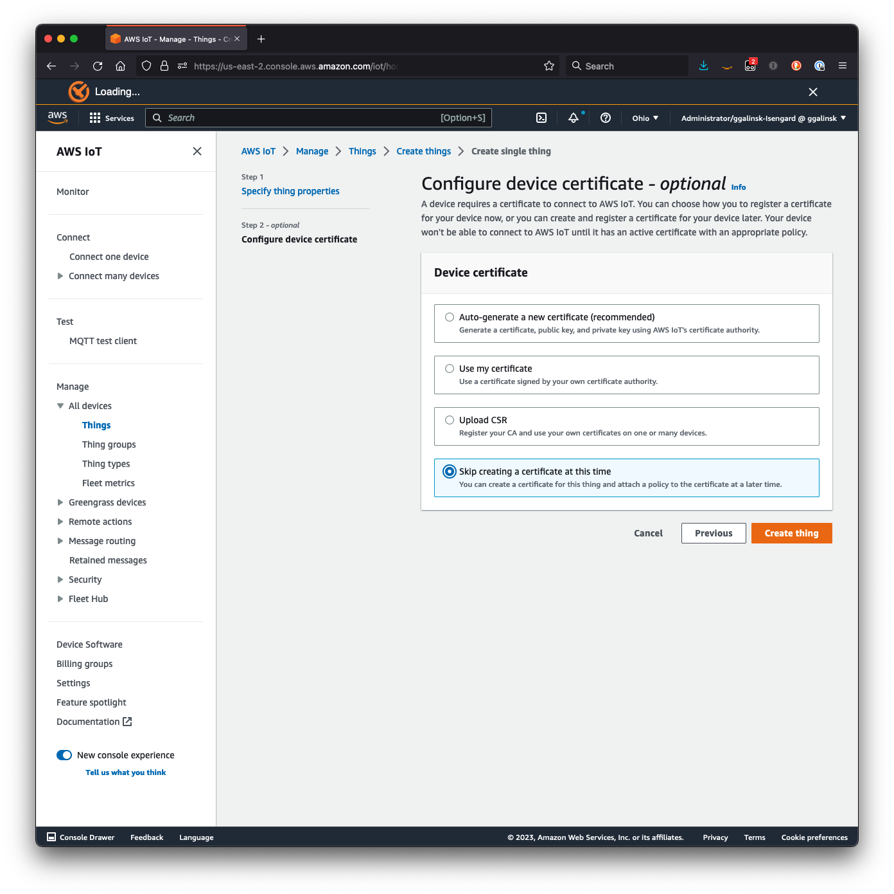
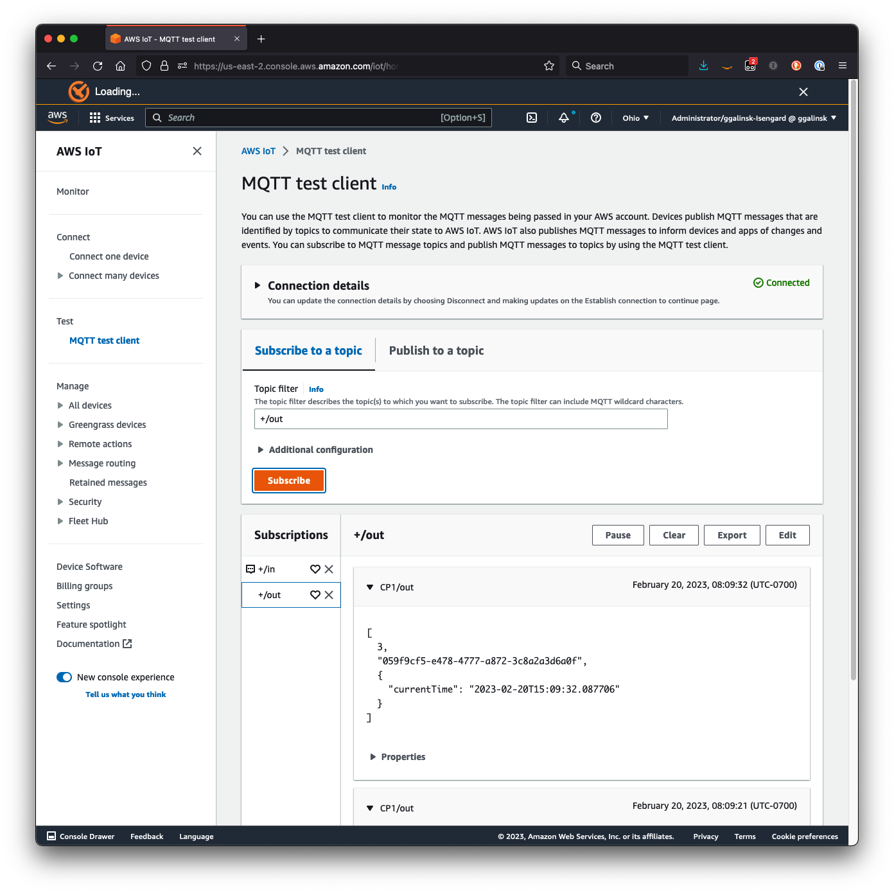
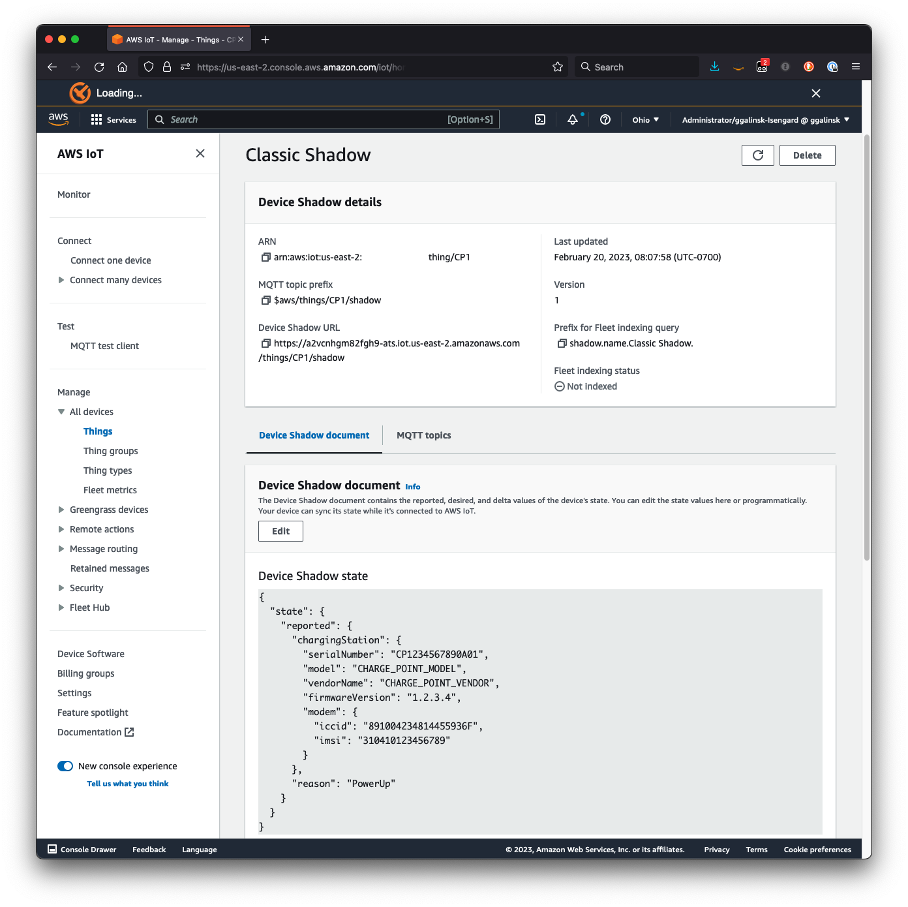
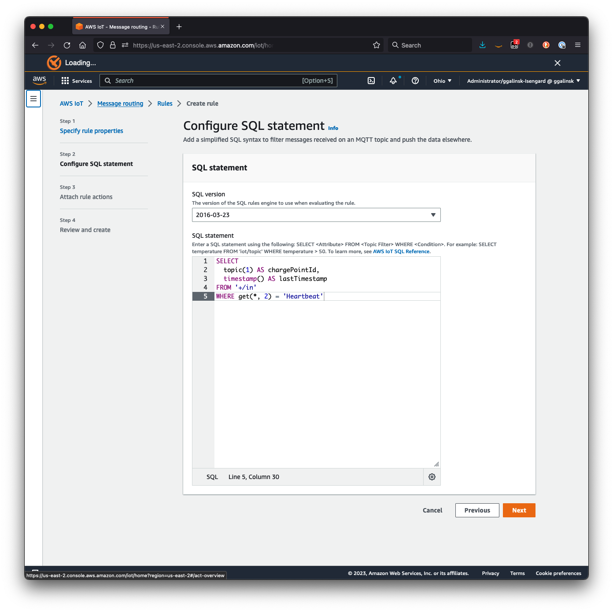
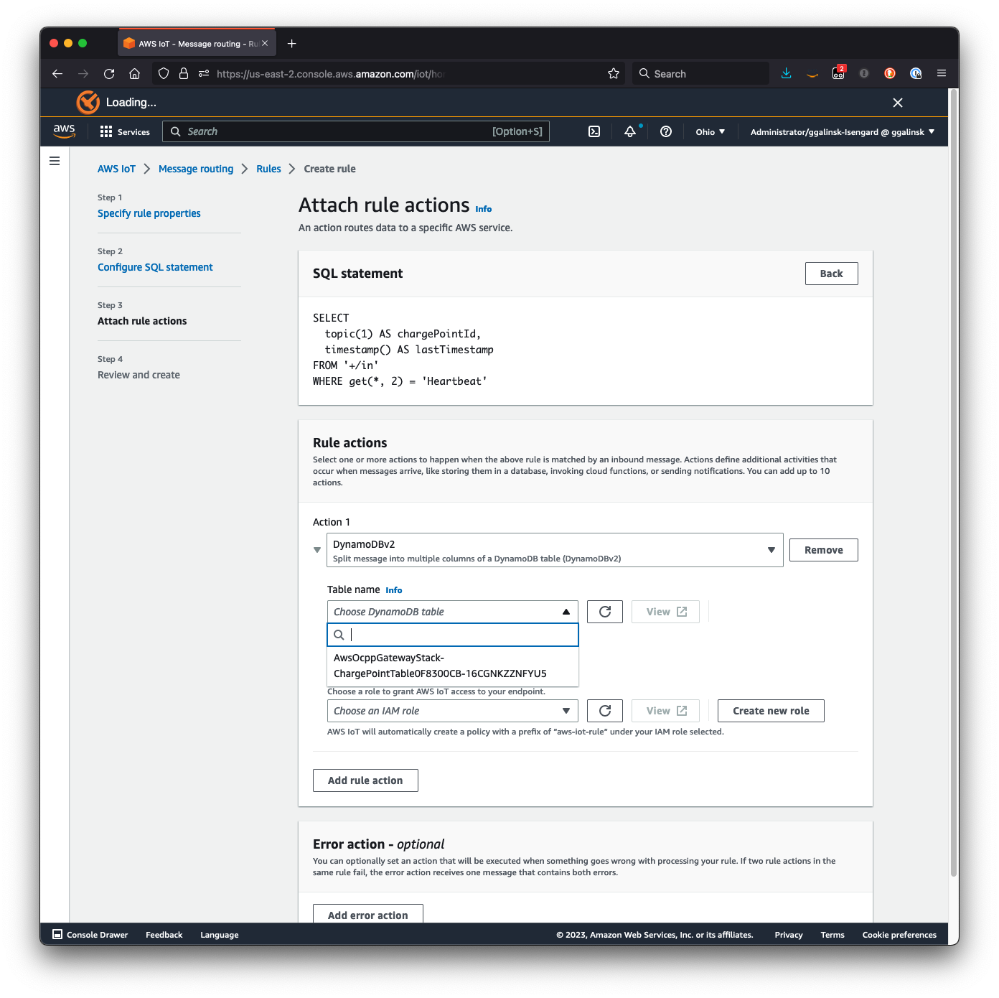

# Building an OCPP-Compliant electric vehicle charge point operator solution using AWS IoT Core


## Table of content

- [Overview](#overview)
- [Architecture](#architecture)
- [Prerequisites](#prerequisites)
- [Deployment](#deployment)
- [Troubleshooting](#troubleshooting)
- [Simulating CP connectivity](#simulating-cp-connectivity)
- [More things to try yourself](#more-things-to-try-yourself)
- [Credits](#credits)
- [License](#license)

## Overview

Most commercially available CPs implement OCPP as a means of bi-directional publish-and-subscribe communication with a CPO. Operating a CPO on AWS requires the introduction of an OCPP WebSocket endpoint, with which CPs communicate. That endpoint, described here as the OCPP Gateway, acts as a proxy between OCPP and MQTT, enabling integration with AWS IoT Core and downstream CPO services built on AWS.

This solution demonstrates how you can use AWS to build a scalable CPO by deploying the OCPP Gateway to integrate with AWS IoT Core. The steps below will walk you through the deployment of an OCPP Gateway into your AWS account, will demonstrate how you can simulate CP message, and will provide examples of you how can act on those message using AWS resources.

For more information read the related [blog post](https://aws.amazon.com/blogs/iot/building-an-ocpp-compliant-electric-vehicle-charge-point-operator-solution-using-aws-iot-core/).

## Architecture

The architecture diagram below depicts the resources that this solution will deploy into your account.

|  |
|:--:| 
| *Figure 1: OCPP Gateway solution stack architecture* |

The OCPP Gateway is deployed as an [Amazon ECS](https://aws.amazon.com/ecs/) application which can run on either [AWS Fargate](https://aws.amazon.com/fargate/) or [Amazon Elastic Compute Cloud (EC2)](https://aws.amazon.com/ec2/). AWS Fargate eliminates the need for infrastructure management and is the preferred option for this solution. Containerized applications can be scaled horizontally, allowing the OCPP Gateway to automatically scale up or down as the number of connected CPs changes. The long running nature of ECS tasks allows for WebSockets connections to be maintained for extended periods, reducing network traffic and connection overheads.

A [Network Load Balancer (NLB)](https://docs.aws.amazon.com/elasticloadbalancing/latest/network/introduction.html) fronts multiple OCPP Gateway containers. The NLB provides a single, fully qualified domain name (FQDN) that serves as the OCPP endpoint to which CPs initiate connection. Upon connection initiation, the NLB will route the charge point connection to one of the OCPP Gateway instances, which will establish the WebSocket connection between itself and the CP.

When a CP establishes a socket connection with an instance of the OCPP Gateway, that Handler sets up an MQTT connection to AWS IoT Core using the CP’s unique identifier as the Thing ID. That client subscribes to MQTT message topics associated with that CP.

The MQTT client implemented by the OCPP Gateway is socket aware, thereby providing a one-to-one association between the MQTT subscription and the CP. Any messages initiated by the CPO will be delivered to the MQTT client associated with the destination CP and forwarded over the socket to that CP. AWS IoT Core is highly elastic and will readily scale as more CPs are on-boarded.


## Prerequisites

Verify that your environment satisfies the following prerequisites:

You have:

1. An [AWS account](https://aws.amazon.com/premiumsupport/knowledge-center/create-and-activate-aws-account/)
2. `AdministratorAccess` policy granted to your AWS account (for production, we recommend restricting access as needed)
3. Both console and programmatic access
4. [AWS CLI](https://aws.amazon.com/cli/) installed and configured to use with your AWS account
5. [NodeJS 12+](https://nodejs.org/en/download/) installed
6. [Typescript 3.8+](https://www.typescriptlang.org/download) installed
7. [AWS CDK CLI](https://docs.aws.amazon.com/cdk/latest/guide/getting_started.html) installed
8. [Docker](https://docs.docker.com/get-docker/) installed
9. [Python 3+](https://www.python.org/downloads/) installed

## Deployment

### Prepare the CDK

The solution will be deployed into your AWS account using infrastructure-as-code wih the [AWS Cloud Development Kit](https://aws.amazon.com/cdk/) (CDK).

1. Clone the repository:

```bash
git clone https://github.com/aws-samples/aws-ocpp-gateway
```

2. Navigate to this project on your computer using your terminal:

```bash
cd aws-ocpp-gateway
```

3. Install the project dependencies by running this command:

```bash
npm install
```

4. Set environment variables for CDK to the target AWS account ID and region where you wish to deploy this stack

> **Note**: AWS IoT Core is available in these [AWS regions](https://docs.aws.amazon.com/general/latest/gr/iot-core.html#iot-core-control-plane-endpoints).

```bash 
export CDK_DEPLOY_ACCOUNT=targetAccountId (e.g. 12345678910)
export CDK_DEPLOY_REGION=targetRegion (e.g. eu-west-1)
```

5. (Optional) Bootstrap AWS CDK on the target account and regioon

> **Note**: This is required if you have never used AWS CDK before on this account and region combination. ([More information on CDK bootstrapping](https://docs.aws.amazon.com/cdk/latest/guide/cli.html#cli-bootstrap)).

```bash
npx cdk bootstrap aws://{targetAccountId}/{targetRegion}
```

### (Optional) Enable WebSockets using TLS with your own domain name

If you have an Amazon Route 53 [hosted zone](https://docs.aws.amazon.com/Route53/latest/DeveloperGuide/hosted-zones-working-with.html) in your account, this solution can automatically:

- Create subdomain (A Record) `gateway.yourdomain.com`
- Create an AWS Certificate Manager (ACM) SSL certificate for it
- Enable TLS for your gateway `wss://gateway.yourdomain.com`
- Uncomment [this line](./bin/aws-ocpp-gateway.ts#L20) in `/bin/aws-ocpp-gateway.ts` and replace `yourdomain.com` with your own domain name (i.e. `example.com`)

```bash
  // domainName: 'yourdomain.com',
```

### Deploy the solution to your AWS Account

1. Verify that Docker is running with the following command:

```bash
docker version
```

> **Note**: If you get an error like the one below, then Docker is not running and need to be restarted:

```bash
Cannot connect to the Docker daemon at unix:///var/run/docker.sock. Is the docker daemon running?
```

2. Deploy the OCPP Gateway using the following CDK command:

```bash
npx cdk deploy
```

> **Note**: This step can take about 10 minutes, depending on your computer and network speed.

3. You can view the progress of your CDK deployment in the [CloudFormation console](https://console.aws.amazon.com/cloudformation/home) in the selected region.

|  |
|:--:|
| *Screenshot: AWS CloudFormation stack resources* |

4. Once deployed, take note of the `AwsOcppGatewayStack.websocketURL` value

> **Note**: This WebSocket URL is the entry point that will be set in your CP configurations or in the *EV Charge Point simulator* described below.

If you used your own domain, your output will look like:
```bash
...
Outputs:
AwsOcppGatewayStack.loadBalancerDnsName = gateway.example.com
👉 AwsOcppGatewayStack.websocketURL = wss://gateway.example.com
...
```

Otherwise, like this:

```bash
...
Outputs:
AwsOcppGatewayStack.loadBalancerDnsName = ocpp-gateway-xxxxxxx.elb.xx-xxxx-x.amazonaws.com
👉 AwsOcppGatewayStack.websocketURL = ws://ocpp-gateway-xxxxxxx.elb.xx-xxxx-x.amazonaws.com
...
```

## Troubleshooting

### Docker not running
If you get an error like the one below, then Docker is not running and need to be restarted:

```bash
Cannot connect to the Docker daemon at unix:///var/run/docker.sock. Is the docker daemon running?
```
Verify that Docker is running with the following command:

```bash
docker version
```

If not, please [start your docker daemon](https://docs.docker.com/engine/reference/commandline/start/)

### Docker not logged in
If you get an error about your docker not being logged in chances are [you've previously authenticated to Amazon ECR Public](https://docs.aws.amazon.com/AmazonECR/latest/public/public-troubleshooting.html#public-troubleshooting-authentication) and your token has expired.

To resolve this error it may be necessary to run the following command
```bash
docker logout public.ecr.aws
```
the try to deploy again.

This will result in an unauthenticated pull and should resolve the error.

### Docker image platform mismatch
If you get an error like the one below:

```bash
...
 ---> [Warning] The requested image's platform (linux/arm64/v8) does not match the detected host platform (linux/amd64) and no specific platform was requested
...
```

You could try to switch the default chip architecure for ECS from `ARM` to `X86_64` by uncommenting [this line](./bin/aws-ocpp-gateway.ts#L16) in [bin/aws-ocpp-gateway.ts](./bin/aws-ocpp-gateway.ts#L16)

### Docker: failed to bundle asset
If you get an error like the one below:

```bash
...
Failed to bundle asset [...], bundle output is located [...]: Error: docker exited with status 1
...
```

chances are your docker install is using a WSL2 based engine, switching to Hyper-V should solve the issue.


## Simulating CP connectivity

We have provided the `simulate.py` Python script to help you test and explore the capability of the OCPP Gateway and AWS IoT Core without the need for a physical CP. Other OCPP simulators, like [OCPP-2.0-CP-Simulator](https://github.com/JavaIsJavaScript/OCPP-2.0-CP-Simulator), can also be used.


### Simulation setup

1. In AWS Explorer, select your region and open **AWS IoT Core, All devices, Things**. On the **Things** tab choose **Create a things**.

2. Select **Create single thing** and choose **Next**

3. Enter a **Thing name**

> **Note**: Each EV Charge Point must map to a single IoT Thing. For our test, we'll set the Thing name as  `CP1`

|  |
|:--:|
| *Screenshot: Creating an IoT Thing* |

4. Choose **Next**

5. For **Device certificate**, select **Skip creating a certificate at this time**, and choose **Create thing**

|  |
|:--:|
| *Screenshot: Skip the certification creation* |

6. Navigate to this folder with your terminal:
```bash
cd ev-charge-point-simulator
```

7. Create a Python virtual environment and activate it by running this command:
```bash
python3 -m venv venv && source venv/bin/activate
```

8. Install the Python dependencies by running:
```bash
pip3 install -r requirements.txt
```


### Simulate an EV charge point boot and heartbeat notification

The Python script simulates some basic functionality of an EV charge point:

- Sending a [`BootNotification`](https://raw.githubusercontent.com/mobilityhouse/ocpp/master/docs/v201/OCPP-2.0.1_part2_specification.pdf#bootnotification), including attributes about the CP hardware
- Sending [`Heartbeat`](https://raw.githubusercontent.com/mobilityhouse/ocpp/master/docs/v201/OCPP-2.0.1_part2_specification.pdf#heartbeat) messages based on a frequency instructed by the CPO (this is defined by the `interval` parameter returned in the response to the `BootNotification`)


1. Run the Python script using the following command, making sure to replace the `--url` value with the `AwsOcppGatewayStack.websocketURL` returned from the cdk deployment:
```bash
python3 simulate.py --url {websocket URL generated from the AWS OCPP Stack} --cp-id CP1 
```

> **Note**: we are using `--cp-id CP1` which *must* match the value of the IoT Thing created above. If the `--cp-id` doesn't match the IoT Thing name, the connection will be rejected by the OCPP Gateway.

A successful output should look like this:

```bash
(venv) ev-charge-point-simulator % python3 simulate.py --url {websocket URL generated from the AWS OCPP Stack} --cp-id CP1 
INFO:ocpp:CP1: send [2,"0678cb2a-a7a2-42bc-8037-d01164e77ac6","BootNotification",{"chargingStation":{"model":"ABC 123 XYZ","vendorName":"Acme Electrical Systems","firmwareVersion":"10.9.8.ABC","serialNumber":"CP1234567890A01","modem":{"iccid":"891004234814455936F","imsi":"310410123456789"}},"reason":"PowerUp"}]
INFO:ocpp:CP1: receive message [3,"0678cb2a-a7a2-42bc-8037-d01164e77ac6",{"currentTime":"2023-02-16T19:00:18.630818","interval":10,"status":"Accepted"}]
INFO:root:CP1: connected to central system
INFO:root:CP1: heartbeat interval set to 10
INFO:ocpp:CP1: send [2,"9b7933a7-5216-496d-9bb0-dae45014bb98","Heartbeat",{}]
INFO:ocpp:CP1: receive message [3,"9b7933a7-5216-496d-9bb0-dae45014bb98",{"currentTime":"2023-02-16T19:00:19.073675"}]
```

This exchange represents a successful simulation of a CP, first sending a `BootNotification`, followed by subsequent `Heartbeat` at the specified interval. The output includes both the simulated OCPP message sent from the CP to AWS IoT (prefixed `send`) and the response received from AWS (prefixed `received message`).


2. To simulate with a different CP, set a different value for the `--cp-id` argument.

> **Note**: if the `--cp-id` value doesn't have a correspondent IoT Thing the OCPP Gateway will reject the connection. Here is an unsuccessful example passing `--cp-id CP2`, which is _not_ registered as a Thing in IoT:

```bash
(venv) ev-charge-point-simulator % python3 simulate.py --url {websocket URL generated from the AWS OCPP Stack} --cp-id CP2 
INFO:ocpp:CP2: send [2,"32dc5b6e-77b0-4105-b217-28e20b579ecc","BootNotification",{"chargingStation":{"model":"ABC 123 XYZ","vendorName":"Acme Electrical Systems","firmwareVersion":"10.9.8.ABC","serialNumber":"CP1234567890A01","modem":{"iccid":"891004234814455936F","imsi":"310410123456789"}},"reason":"PowerUp"}]
ERROR:root:CP2: received 1008 (policy violation) Charge Point CP2 not registered as an IoT Thing; then sent 1008 (policy violation) Charge Point CP2 not registered as an IoT Thing
```


### Monitor OCPP activity in the AWS Console

Messages from and to the CP are brokered through AWS IoT Core. These messages utilize the MQTT publish-and-subscribe protocol. You can see these messages in the console.

1. In AWS Explorer, select your region and open **AWS IoT Core, MQTT test client**

2. In the test client, select the **Subscribe to a topic** tab, and subscribe to these two topics by entering these values in the **Topic filter**:

   a. To view all messages from CP to AWS
```bash
+/in
```

   b. To view all messages from AWS to CP
```bash
+/out
```

|  |
|:--:|
| *Screenshot: Subscribe to Topics* |

3. Run the Python script to simulate a CP and watch the messages in the MQTT test client


### Track EV Charge Point hardware attributes in device shadows

When a CP sends a `BootNotification`, its hardware attributes are stored in a Device Shadow associated with the IoT Thing. You can see these attributes in the console.

1. In AWS Explorer, select your region and open **AWS IoT Core, All devices, Things**

2. Toggle the check box against the Thing created previously

3. Select the **Device Shadows** tab.

4. Select the **Classic Shadow**  device shadow name hyperlink to see the **Device Shadow document** and the hardware attributes reported by the EV Charge Point:

```json
{
  "state": {
    "reported": {
      "chargingStation": {
        "model": "ABC 123 XYZ",
        "vendorName": "Acme Electrical Systems",
        "firmwareVersion": "10.9.8.ABC",
        "serialNumber": "CP1234567890A01",
        "modem": {
          "iccid": "891004234814455936F",
          "imsi": "310410123456789"
        }
      },
      "reason": "PowerUp"
    }
  }
}
```

|  |
|:--:|
| *Screenshot: IoT Thing shadow document* |

5. Simulate different CP hardware attributes by passing these arguments into the `simulate.py` script and verify their affect on the Device Shadow:

- `--cp-serial` - to set the serial number
- `--cp-model` - to set the model identification
- `--cp-version` - to set the firmware version
- `--cp-vendor` - to set the vendor name

## (Optional) More things to try yourself

This section provides some suggested simulations and tests you can try yourself to better appreciate the *art of the possible* as it relates to building an OCPP-compliant CPO on AWS.

### Load testing

AWS IoT Core is a fully managed, highly elastic service that scales to support millions of Things. The OCPP Gateway uses auto-scaling to automatically scale-up as your fleet of CPs grows.

1. Using a load testing tool or the included Apache JMeter configuration, simulate a load of thousands of CPs

2. In AWS Explorer, select your region and open **Elastic Container Service**

3. Under **Clusters** open the hyperlink of the cluster created by the OCPP Gateway stack (will be prefixed `AwsOcppGatewayStack`)

4. Select the **Metrics** tab

5. Watch how the number of tasks increases from one to two, etc. as your load increases.

> Auto-scaling is configured to trigger when the average CPU utilization exceeds 60% -- you can drive more load or decrease this threshold to test the affect.

> **If you are using JMeter or similar load tester** be cautious of the number of threads (Things) you create and duration you run your test for. The solution will readily scale to many thousands of Things and will run for indefinite periods of time, which may result in unexpected charges in your AWS account. We suggest using the load test to test scalability, but to halt the test quickly to reduce costs.

### Rules for AWS IoT

[Rules for AWS IoT](https://docs.aws.amazon.com/iot/latest/developerguide/iot-rules.html) can be used to filter MQTT messages and route them to other services in AWS. Create a new rule to capture `Heartbeat` messages and record them in a DynamoDB table for a last known event.

1. In AWS Explorer, select your region and open **DynamoDB**

2. Select **Create table**

3. Provide the **Table name** `chargePointHeartbeat` and set the **Partition key** to `chargePointId`

4. Choose **Create table**

5. In AWS Explorer, select your region and open **AWS IoT Core, Message routing, Rules**

6. Select **Create Rule**

7. Provide the **Rule name** `chargePointHeartbeat` and choose **Next**

8. Enter the following into the **SQL statement** and choose **Next**

```sql
SELECT 
  topic(1) AS chargePointId,
  timestamp() AS lastTimestamp
FROM '+/in'
WHERE get(*, 2) = 'Heartbeat'
```

8. For **Action 1**, choose **DynamoDBv2**

|  |
|:--:|
| *Screenshot: IoT Rule SQL statement* |


9. Select the Amazon DynamoDB table created above for **Table name**

|  |
|:--:|
| *Screenshot: IoT Rule action* |

10. Select **Create new role**, provide the **Role name** `chargePointHeartbeat`, choose **Create**

11. Choose **Next** and **Create**

12. Navigate back to **DynamoBD** and select **Tables, Explore Items**

13. For **Tables**, choose the DynamoDB table created previously

14. Run the Python script to simulate a CP and watch as heartbeat are added and update in the DynamoDB table


### Connection handling

A single CP should only maintain one connection to one OCPP Gateway, otherwise routing of responses from the CPO to the right connection may be affected. You can simulate a reconnection attempt.

1. (Optional) If you don't already have it, download and install the [`wscat`](https://www.npmjs.com/package/wscat) utility

2. Open a terminal windows and establish a WebSocket connection:

```bash
wscat -c {AwsOcppGatewayStack.websocketURL}/CP1 -s ocpp2.0.1
Connected (press CTRL+C to quit)
>
```

3. In a second terminal window run the same command, attempting to create another connection using the same CP, e.g. `CP1`

4. Once this new connection is established you'll see that the prior connection is automatically closed:

```bash
Disconnected (code: 1000, reason: "")
```

5. Testing a connection with a CP that is not configured as an IoT Thing will result in the connection attempt being rejected:

```bash
wscat -c {AwsOcppGatewayStack.websocketURL}/CPX -s ocpp2.0.1
Connected (press CTRL+C to quit)
Disconnected (code: 1008, reason: "Charge Point CPX not registered as an IoT Thing")
```


## Clean up
When you are done running simulations, deactivate the Python virtual environment (`venv`) by executing this command in your terminal:

```bash
deactivate
```

You can remove the OCPP Gateway Stack and all the associated resources created in your AWS account by running the following command:

```bash
npx cdk destroy
```

## Credits

This sample was made possible thanks to the following libraries:
- [ocpp](https://github.com/mobilityhouse/ocpp) from [Mobility House](https://github.com/mobilityhouse)
- [asyncio-mqtt](https://github.com/sbtinstruments/asyncio-mqtt) from [sbtinstruments](https://github.com/sbtinstruments)


## License

This library is licensed under the MIT-0 License. See the LICENSE file.

- [Changelog](CHANGELOG.md) of the project.
- [License](LICENSE) of the project.
- [Code of Conduct](CODE_OF_CONDUCT.md) of the project.
- [CONTRIBUTING](CONTRIBUTING.md#security-issue-notifications) for more information.
